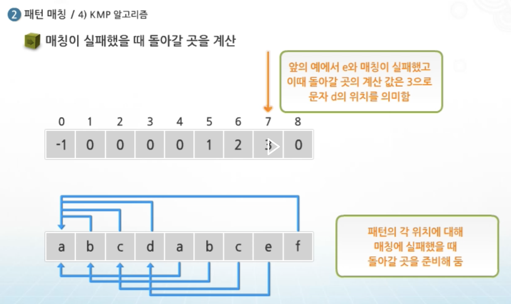
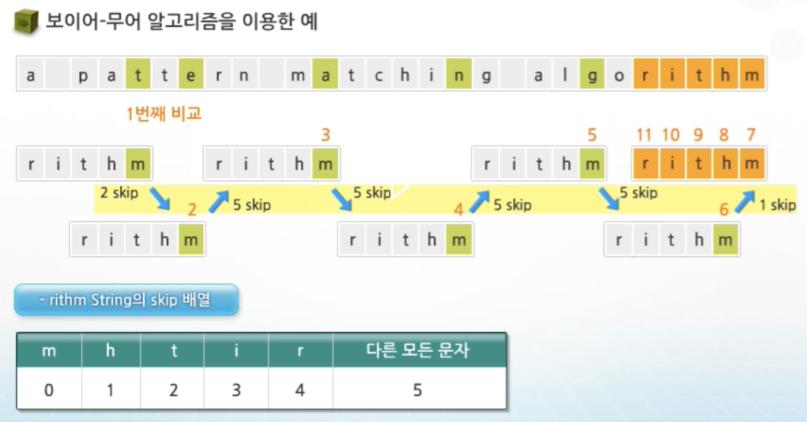

# 문자열 패턴 매칭 알고리즘 (String Pattern Matching)

> **문제 정의**: 길이 `n`인 텍스트 `T`에서 길이 `m`인 패턴 `P`가 등장하는 **모든 위치**를 찾는다.

전체 코드는 다음 헤더를 가정한다.

```cpp
#include <string>
#include <vector>
#include <algorithm>
using namespace std;
```

---

## Chapter 0 — 패턴 매칭 알고리즘 개요

### 0.1 무엇을 비교하느냐로 갈린다

| 분류 | 대표 | 핵심 발상 |
|---|---|---|
| 단순 비교 | Brute Force | 모든 시작 위치에서 처음부터 비교 |
| **접두사(prefix) 기반** | KMP | 실패 시, 이미 일치한 접두사 정보를 재활용해 패턴을 점프 |
| **접미사(suffix) 기반** | Boyer-Moore | 패턴을 오른쪽→왼쪽 비교, 불일치 시 큰 폭으로 점프 |
| 해싱 기반 | Rabin-Karp | 부분 문자열 해시값으로 후보를 빠르게 거른다 |
| 오토마타 기반 | Aho-Corasick | 여러 패턴 동시 검색(트라이 + 실패 링크) |

이 문서에서는 위 표의 BF / KMP / Boyer-Moore 세 개를 다룬다.

### 0.2 평가 지표 — "전처리 + 검색"으로 나눠 본다

알고리즘의 비용은 항상 **전처리(preprocessing)** 와 **검색(matching)** 두 단계로 분리해서 봐야 한다.

| 알고리즘 | 전처리 | 검색(최악) | 검색(최선) | 추가 공간 |
|---|---|---|---|---|
| Brute Force | 없음 | `O(nm)` | `O(n)` | `O(1)` |
| KMP | `O(m)` | `O(n)` | `O(n)` | `O(m)` |
| Boyer-Moore (나쁜 문자) | `O(m + σ)` | `O(nm)` | **`O(n/m)`** | `O(σ)` |
| Boyer-Moore (전체, Galil) | `O(m + σ)` | `O(n)` | `O(n/m)` | `O(m + σ)` |

- `n` = 텍스트 길이, `m` = 패턴 길이, `σ` = 알파벳 크기(예: ASCII 256).
- 핵심 직관 한 줄: **KMP는 "절대 뒤로 안 가는" 선형 보장**, **Boyer-Moore는 "운 좋으면 글자를 통째로 건너뛰는" 실전 속도**.

### 0.3 공통 인터페이스

세 알고리즘 모두 아래 시그니처로 통일한다. 반환값은 매칭이 시작된 0-기반 인덱스 목록이다.

```cpp
// 반환: 패턴이 시작되는 모든 인덱스
vector<int> search(const string& text, const string& pattern);
```

---

## Chapter 1 — Brute Force (BF, 단순 비교)

### 1.1 이론

가장 단순하다. 텍스트의 가능한 모든 시작 위치 `i` (`0 ≤ i ≤ n - m`)에 패턴을 갖다 대고, 앞에서부터 한 글자씩 비교한다.

- 끝까지 일치 → 위치 `i` 기록.
- 중간에 불일치 → `i`를 **1만 증가**시키고 다시 처음(`j = 0`)부터 비교.

여기서 BF의 약점이 드러난다. **불일치가 나면 지금까지 비교한 정보를 전부 버리고 한 칸만 밀어서 처음부터 다시 비교한다.** KMP는 바로 이 "버리는 정보"를 재활용하는 알고리즘이다.

### 1.2 동작 예시

```
T = "ABABABCABABABCAB"  P = "ABABC"

i=0:  ABAB[C]  →  T[4]='A' vs P[4]='C' 불일치 → i=1로
i=1:  T[1]='B' vs P[0]='A' 불일치 → i=2로
i=2:  ABAB[C] → T[6]='C' vs P[4]='C' 일치! → 위치 2 기록
...
```

### 1.3 복잡도

- **최악 `O(nm)`**: `T = "aaaa...a"`, `P = "aaa...ab"` 처럼 거의 다 일치하다 마지막에 틀리는 경우, 매 시작 위치마다 `m`번 비교한다.
- **평균/최선**: 랜덤 텍스트에서는 보통 한두 글자 만에 불일치가 나므로 실측은 `O(n)`에 가깝다.
- 전처리 없음, 추가 공간 `O(1)` — **구현이 가장 쉽고 패턴이 짧으면 충분히 빠르다.**

### 1.4 코드

```cpp
vector<int> bruteForceSearch(const string& text, const string& pattern) {
    vector<int> result;
    int n = (int)text.size(), m = (int)pattern.size();
    if (m == 0 || m > n) return result;

    for (int i = 0; i <= n - m; ++i) {
        int j = 0;
        while (j < m && text[i + j] == pattern[j])
            ++j;
        if (j == m)            // 패턴 끝까지 일치
            result.push_back(i);
    }
    return result;
}
```

> **포인트**: 불일치가 나면 `i`는 `+1`만, `j`는 항상 `0`으로 리셋된다. 이 "리셋" 때문에 텍스트 포인터가 사실상 뒤로 되돌아가는 효과가 생긴다. KMP는 이 되돌림을 없앤다.

---

## Chapter 2 — KMP (Knuth-Morris-Pratt)

<div align=center>
    
    <h5></h5>
</div>

### 2.1 핵심 아이디어 — "이미 맞춘 건 알고 있다"

불일치가 발생한 순간, 우리는 **패턴의 앞부분 몇 글자가 이미 텍스트와 일치했는지** 정확히 알고 있다. 이 정보를 버리지 않는다.

예를 들어 `P = "ABABC"` 에서 `ABAB`까지 맞고 `C`에서 틀렸다면, 이미 맞은 `ABAB`의 **접미사 `AB`가 패턴의 접두사 `AB`와 같다**. 그러니 패턴을 처음으로 되돌릴 필요 없이, 패턴의 `AB` 다음(인덱스 2)부터 이어서 비교하면 된다. **텍스트 포인터 `i`는 절대 뒤로 가지 않는다.**

### 2.2 실패 함수 (LPS 배열)

이 "얼마나 점프할 수 있는가"를 미리 계산해 둔 것이 **LPS(Longest Proper Prefix which is also Suffix)** 배열, 곧 실패 함수다.

> `lps[i]` = `P[0..i]` 구간에서 **접두사이면서 동시에 접미사**인 가장 긴 문자열의 길이.
> (단, 자기 자신 전체는 제외 → "proper")

`P = "ABABC"` 의 LPS:

| i | P[i] | 부분문자열 | 접두사=접미사 최대 | lps[i] |
|---|---|---|---|---|
| 0 | A | A | (없음) | 0 |
| 1 | B | AB | (없음) | 0 |
| 2 | A | ABA | "A" | 1 |
| 3 | B | ABAB | "AB" | 2 |
| 4 | C | ABABC | (없음) | 0 |

불일치 시 `j = lps[j-1]`로 점프한다. "`ABAB`까지 맞고 틀림(j=4)" → `j = lps[3] = 2` → 패턴 인덱스 2부터 재개.

### 2.3 공통 연산 — 한 글자 먹이기 (상태 전이)

`computeLPS`와 `kmpSearch`는 사실 **똑같은 한 가지 연산**을 반복한다.

> "지금까지 일치한 길이 `matched`에 글자 하나 `c`를 먹여, **갱신된 일치 길이**를 돌려준다."

이것이 KMP를 **오토마타**로 봤을 때의 **상태 전이 함수**다. 이 한 조각(`step`)만 떼어 내면 두 함수가 그 위의 얇은 루프로 줄어든다. 동작은 "**불일치면 물러나고(while) → 일치면 1 늘린다(if)**" 두 줄이 전부다.

```cpp
// KMP 한 스텝 = 오토마타 상태 전이.
// matched: 지금까지 일치한 패턴 길이, c: 새 글자 → 갱신된 일치 길이 반환
int step(int matched, char c, const string& pattern, const vector<int>& lps) {
    while (matched > 0 && c != pattern[matched])
        matched = lps[matched - 1];     // 다르면 물러난다
    if (c == pattern[matched])
        ++matched;                       // 같으면 1 전진
    return matched;
}
```

> **`matched == 0`의 의미**: "되돌아갈 경계가 없다"일 뿐 "0을 확정하라"가 아니다. `while`만 스킵되고, 그 뒤 `if (c == pattern[0])` 즉 **현재 글자가 패턴 첫 글자와 같은지**는 여전히 검사한다. 같으면 길이 1짜리 새 접두사가 시작돼 `matched = 1`이 된다.

### 2.4 LPS 계산 — 패턴을 자기 자신에 매칭

LPS 계산은 곧 **패턴을 자기 자신에 대해 KMP 검색하는 것**이다. `step`에 비교 대상으로 (텍스트가 아니라) **패턴 자신**을 넘기면 된다. 어느 분기로 가든 마지막에 `lps[i]`를 **딱 한 번** 기록하는 게 핵심이라, "값을 안 쓰고 빠지는" 실수가 구조적으로 막힌다.

```cpp
vector<int> computeLPS(const string& p) {
    int m = (int)p.size();
    vector<int> lps(m, 0);
    int len = 0;                        // 직전까지의 최장 접두사=접미사 길이
    for (int i = 1; i < m; ++i) {
        len = step(len, p[i], p, lps);  // 패턴을 자기 자신에 매칭 = LPS
        lps[i] = len;
    }
    return lps;
}
```

> 아직 만들고 있는 `lps`를 `step`에 넘기는데도 안전한 이유: `i` 시점에 `step`이 읽는 `lps[matched-1]`은 `matched-1 < i`라 **이미 채워진 칸**뿐이다.

### 2.5 검색 코드 — 텍스트에 매칭

`step`에 이번엔 텍스트 글자를 먹인다. 패턴 끝(`matched == m`)에 도달했는지 검사만 하나 더 붙는다. 여기서 `j`는 "지금까지 일치한 패턴 길이"이자 동시에 "다음에 비교할 패턴 인덱스"다.

```cpp
vector<int> kmpSearch(const string& text, const string& pattern) {
    vector<int> result;
    int n = (int)text.size(), m = (int)pattern.size();
    if (m == 0 || m > n) return result;

    vector<int> lps = computeLPS(pattern);
    int j = 0;                          // 일치한 패턴 길이 = 다음에 비교할 패턴 인덱스
    for (int i = 0; i < n; ++i) {
        j = step(j, text[i], pattern, lps);
        if (j == m) {                   // 패턴 끝까지 도달 → 매칭 성공
            result.push_back(i - m + 1);    // 매칭 시작 위치
            j = lps[j - 1];                 // 겹침 매칭 대비 점프
        }
    }
    return result;
}
```

> 텍스트 포인터 `i`는 `for`에 고정돼 **항상 한 번만 전진**한다 — KMP가 "절대 뒤로 안 간다"는 성질이 코드 구조에 그대로 박혀 있다. BF의 `else { ++i; }`(첫 글자부터 틀림) 분기는 `step` 안에서 `j == 0`일 때 `while`이 스킵되고 `i`가 자동 전진하는 것으로 흡수된다.

### 2.6 복잡도와 포인트

- 전처리 `O(m)` + 검색 `O(n)` = **총 `O(n + m)`**, 추가 공간 `O(m)`.
- 검색이 선형인 이유: `i`는 단조 증가만 하고, `j`의 감소 총량은 증가 총량을 넘을 수 없다(amortized 분석).
- **핵심 추상화**: LPS 계산과 검색은 결국 **같은 `step`(상태 전이)** 을 돌린다. 차이는 입력 문자열뿐 — `computeLPS`는 패턴을 자기 자신에, `kmpSearch`는 텍스트를 패턴에 먹인다. "**LPS 계산 = 패턴의 자기 자신에 대한 KMP**"로 외우면 코드 두 개가 하나로 묶인다.
- **코테 실수 1순위**: 불일치 시 `j = lps[j-1]`로 **물러날 때 `i`(텍스트 포인터)를 같이 올리면 버그**다. `step`으로 빼 두면 `i` 전진이 호출부 `for`에만 있어 이 실수가 원천 차단된다 — 인라인 while 형태로 직접 쓸 때 특히 주의.

---

## Chapter 3 — 보이어-무어 (Boyer-Moore)

<div align=center>
    
    <h5></h5>
</div>

### 3.1 핵심 아이디어 — "뒤에서부터, 크게 건너뛴다"

BF/KMP가 패턴을 **왼쪽→오른쪽**으로 비교한다면, Boyer-Moore는 **오른쪽→왼쪽**으로 비교한다. 그리고 불일치가 나면 두 가지 휴리스틱 중 더 크게 미는 쪽을 택해 패턴을 점프시킨다. 운이 좋으면 텍스트의 많은 글자를 **아예 보지도 않고** 건너뛴다 — 그래서 최선 복잡도가 `O(n/m)`로 **선형보다도 빠른(sublinear)** 유일한 알고리즘이다.

### 3.2 휴리스틱 1 — 나쁜 문자 규칙 (Bad Character)

불일치가 난 **텍스트 글자 `c`** 를 기준으로 민다.

- 패턴 안에 `c`가 있으면 → 패턴에서 `c`가 나타나는 **가장 오른쪽 위치**를 불일치 지점에 맞추도록 민다.
- 패턴 안에 `c`가 아예 없으면 → 패턴 전체를 `c` 다음으로 건너뛴다 (가장 큰 점프).

```
T = ...X...     P = "ABCAB",  텍스트 글자 'X'가 패턴에 없음
                → X 너머로 패턴 전체를 점프
```

### 3.3 휴리스틱 2 — 좋은 접미사 규칙 (Good Suffix) — 개념

오른쪽부터 비교하다 일부 접미사가 일치한 뒤 불일치가 나면, **그 일치한 접미사(good suffix)** 가 패턴 내 다른 곳에 또 등장하는지를 이용해 민다. KMP의 접두사 아이디어를 접미사 버전으로 뒤집은 것이라 보면 된다.

> 실무/코테에서는 보통 **나쁜 문자 규칙만 구현**해도 충분히 빠르다(이게 Horspool 변형의 기반). 좋은 접미사까지 넣어야 최악 `O(n)`이 보장되지만 구현이 길고 버그가 잦으므로, 아래 코드는 **나쁜 문자 규칙 버전**을 제공한다.

### 3.4 코드 (나쁜 문자 규칙)

```cpp
// 각 문자가 패턴에서 마지막으로 등장하는 인덱스 테이블 (없으면 -1)
vector<int> buildBadCharTable(const string& pattern) {
    vector<int> badChar(256, -1);
    for (int i = 0; i < (int)pattern.size(); ++i)
        badChar[(unsigned char)pattern[i]] = i;   // 갱신 → 자동으로 '가장 오른쪽'
    return badChar;
}

vector<int> boyerMooreSearch(const string& text, const string& pattern) {
    vector<int> result;
    int n = (int)text.size(), m = (int)pattern.size();
    if (m == 0 || m > n) return result;

    vector<int> badChar = buildBadCharTable(pattern);
    int s = 0;                          // 텍스트에 대한 패턴의 시작 위치(shift)
    while (s <= n - m) {
        int j = m - 1;
        while (j >= 0 && pattern[j] == text[s + j])   // 오른쪽→왼쪽
            --j;

        if (j < 0) {                    // 끝까지 일치 → 매칭
            result.push_back(s);
            // 다음 글자 기준으로 한 칸 이상 민다 (경계 체크)
            s += (s + m < n) ? m - badChar[(unsigned char)text[s + m]] : 1;
        } else {
            int shift = j - badChar[(unsigned char)text[s + j]];
            s += max(1, shift);         // 최소 1칸은 전진(무한루프 방지)
        }
    }
    return result;
}
```

### 3.5 복잡도와 포인트

- 전처리 `O(m + σ)`, 검색 최선 `O(n/m)`, **나쁜 문자만 쓰면 최악 `O(nm)`** (예: `T="aaaa"`, `P="baaa"`).
- `max(1, shift)` 는 필수다. 나쁜 문자가 불일치 지점보다 오른쪽에 있으면 `shift`가 음수가 되어 **뒤로 가거나 제자리** 무한루프가 생긴다.
- 패턴이 길고 알파벳이 클수록(영어 문장 검색 등) 점프 폭이 커져 실측 성능이 가장 좋다. 이 때문에 텍스트 에디터의 grep류 검색에 널리 쓰인다.

---

## Chapter 4 — (보너스) C++ 표준 라이브러리

직접 구현 대신 표준을 쓸 수 있는 경우도 알아 두면 좋다. **단, 코테에서는 구현을 요구하는 경우가 대부분이므로 위 직접 구현이 우선이다.**

### 4.1 `std::string::find` — 가장 기본

내부 구현은 표준이 강제하지 않으나(대개 BF 수준), 단발성 검색에는 충분하다.

```cpp
string text = "ABABABCABABABCAB", pat = "ABABC";
size_t pos = text.find(pat);              // 첫 위치
while (pos != string::npos) {
    // pos 사용
    pos = text.find(pat, pos + 1);        // 다음 위치
}
```

### 4.2 C++17 `std::search` + Boyer-Moore searcher

C++17부터 `<functional>`에 검색기(searcher)가 추가됐다. **Boyer-Moore / Horspool을 표준이 제공**한다.

```cpp
#include <functional>     // boyer_moore_searcher
#include <algorithm>      // std::search

string text = "ABABABCABABABCAB", pat = "ABABC";

auto it = std::search(
    text.begin(), text.end(),
    std::boyer_moore_searcher(pat.begin(), pat.end()));   // 같은 패턴 반복 검색 시 유리

if (it != text.end()) {
    int idx = (int)(it - text.begin());   // 매칭 시작 인덱스
}
```

- `std::boyer_moore_searcher` — 전체 보이어-무어.
- `std::boyer_moore_horspool_searcher` — 나쁜 문자 기반의 경량 변형.
- `std::default_searcher` — 단순 비교(BF).
- 같은 패턴으로 **여러 텍스트를 반복 검색**할 때 전처리를 재사용할 수 있어 이득이 크다.

---

## 마무리 — 코테 관점 선택 가이드

| 상황 | 선택 |
|---|---|
| 패턴이 짧고 텍스트도 작다 | **BF** — 구현 빠르고 충분 |
| "특정 패턴 등장 위치/횟수", 최악도 선형 보장 필요 | **KMP** — 가장 무난한 정답 |
| 패턴이 길고 알파벳이 큰 자연어 검색, 실측 속도 중요 | **Boyer-Moore** |
| 패턴이 여럿(다중 패턴 동시 검색) | (확장) **Aho-Corasick** |

> **한 줄 정리**: 코테 문자열 매칭은 **KMP를 손에 익히는 것**이 핵심이고(LPS 점프 로직), BF는 디버깅용 기준선, Boyer-Moore는 "오른쪽부터 비교 + 나쁜 문자 점프"라는 발상을 이해해 두는 용도다.