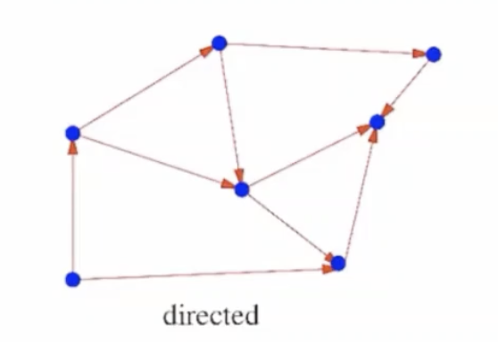
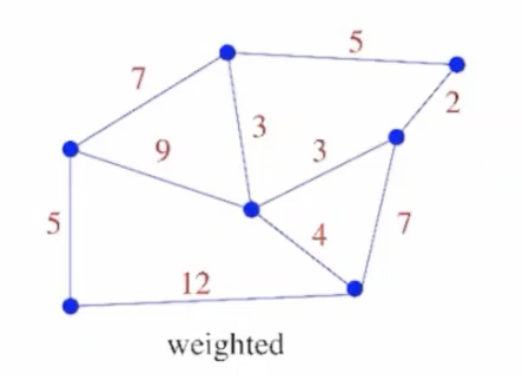

> ### 📄 Flavors of Graphs

#### 1). 방향 그래프 VS 무방향 그래프

	
	<h5></h5>

**에지는 정렬되지 않은 쌍 $\{u, v\}$ (무방향 그래프)**
**정렬된 쌍 $(u, v)$ (방향 그래프)로 표현할 수 있습니다.**

---

#### 2). 가중치 그래프 VS 무가중치 그래프

	
	<h5></h5>

---

#### 3). Simple VS Self-Loop Graph

1. Simple : $E \subseteq \{ (u, v) \mid u, v \in V,\ u \neq v \}$
2. Self-Loop Graph : $E \subseteq \{ (u, v) \mid u, v \in V\}$
   * 즉 정점쌍 ${u, v}$에서 $u = v$를 허용하는 그래프다.

---

#### 4). 회소 간선 VS 조밀 간선

* 그래프를 표현하는 방법을 판단하게 된다.

1. 조밀 간선 경우에는 인접 행렬
2. 희소 간선에 경우에는 인접 리스트

---

#### 5). Bipartite Graph (이분 그래프)

이분 그래프는 정점 집합 $V$를 두 개의 분리된 부분집합 $V_1, V_2$로 나눌 수 있는 그래프입니다.

$$
V = V_1 \cup V_2, \quad V_1 \cap V_2 = \emptyset
$$

**정의적 특성** :
1. 동일한 부분집합 내의 정점들끼리는 **절대 연결되지 않음**
2. 서로 다른 부분집합의 정점들 사이에만 간선이 존재
3. 수식적으로: $\forall (u,v) \in E$에 대해 $(u \in V_1 \land v \in V_2) \lor (u \in V_2 \land v \in V_1)$

**2-컬러링(2-coloring) 관점** :
* 모든 정점을 두 가지 색깔로 칠할 수 있음
* 인접한 정점들은 항상 다른 색깔을 가짐
* **정리**: 그래프가 이분 그래프 <-> 홀수 길이 사이클이 존재하지 않음

**예시** : 이성애자 집단.

---

#### 6). DAG (Directed acyclic graph)

##### 위상 정렬은 DAG에서만 가능하며, 의존성이 있는 작업들의 순서를 결정하는 핵심 알고리즘.

##### ① 수학적 표현

* 그래프 $G = (V, E)$ 가 DAG일 때,
* 모든 간선 $(u,v) \in E$ 에 대해 $u$ 가 $v$ 보다 앞에 위치하는 순열을 찾는 것

##### ② 전제 조건 (매우 중요)
* **반드시 방향 그래프여야 함**
* **사이클이 절대 없어야 함 (DAG)**
* 사이클이 있으면 위상 정렬은 불가능

---

