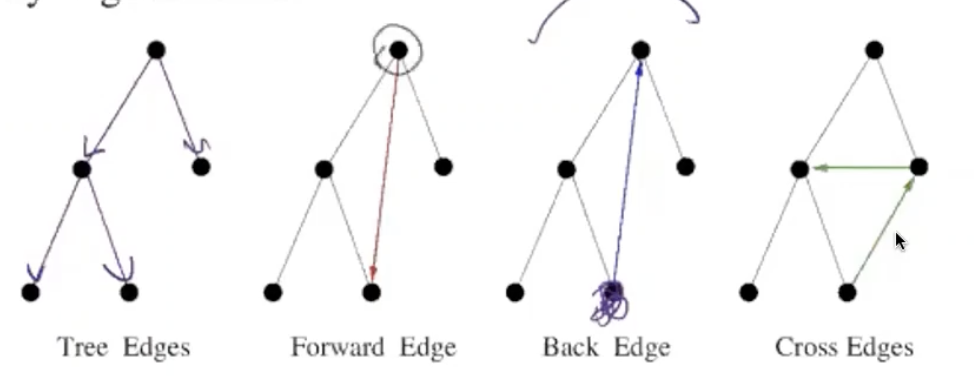
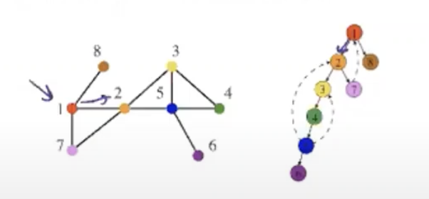
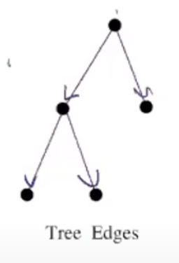
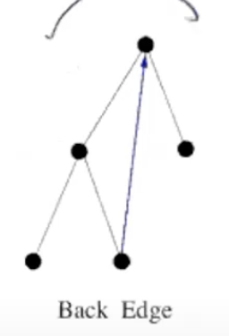

---

## 알고리즘

---

> ### 📄 1 BFS & DFS

#### 1). BFS

* 단점이라 할 것은 중복된 정점이 Queue에 들어갈 이슈가 있다는것 이다.
* Edge Classification : 방향 그래프든, 무방향 그래프든
다음 형태로 모두 나타날 수 있다.


```cpp
TreeEdge struct {
	int root;
	vector<int> childs;
}

bool is_visited[MAXV + 1] = {0,};

void BFS(map<int, TreeEdge>& out, int sV) {
	queue<int> q;
	q.push(sV);
	is_visited[sV] = true;
	out[sV].root = sV;

	while(!q.empty()) {
		int cur = q.front(); q.pop();
		for(auto& e : g[cur]) {
			if(!is_visited[e.to]) {
				out[cur].childs.push_back(e.to);
				q.push(e.to);
				is_visited[e.to] = true;
			}
		}
	}

	for(auto& tree : out) {
		tree.root = sV;
	}
}

void LevelBFS(int sV) {
	queue<int> q;
	int level = 0;

	q.push(sV);
	is_visited[sV] = true;

	while(!q.empty()) {
		int level_sz = q.size();

		for(int i = 0; i < level_sz; i++) {
			int cur = q.front();
			q.pop();

			for(auto& e : g[cur]) {
				if(!is_visited[e.to]) {
					q.push(e.to);
					is_visited[e.to] = true;
				}
			}
		}
		level++;
	}
}

// 신기하게도.. O(N + M) 이것도 시간 복잡도가 걸린다.
// O(N * (N + M))
// 아마도 n을 쪼개서 n_1, n_2 에지도 e 쪼개서 e_1, e_2가 되서
//
void ConnectedComponents() {
    vector<map<int, TreeEdge>> trees;

    // 방문 배열 초기화
    fill(is_visited, is_visited + MAX_V + 1, false);

    for(int i = 1; i <= n; i++) {
        if(!is_visited[i]) {
            map<int, TreeEdge> component_tree;
            BFS(component_tree, i);
            trees.push_back(component_tree);
        }
    }
}
```


---

#### 2). DFS

<div align=center>
	
	<h5></h5>
</div>

```cpp
bool is_visited[MAXV + 1] = {0,};

void DFS(int sV) {
	is_visited[sV] = true;
	for(auto& e : g[sV]) {
		if(!is_visited[sV]){
			DFS(e.to);
		}
	}
}
```

* Edge Classification : 방향 그래프는 반드시
DFS 순회시 나타나는 강점은 다음 두가지의 형태로 순회되는것이 보장된다.
  | Tree Edges                         | Back Edge                          |
  | ---------------------------------- | ---------------------------------- |
  |  |  |
* 이를 응용하면 사이클 탐색이 가능해 진다.
  ```cpp
  int parent[MAX_V + 1] = {0,}


  bool DFS(int sV) {
  	is_visited[sV] = true;
	bool flag = false;

  	for(auto& e : g[sV]) {
  		if(!is_visited[sV]){
			parent[e.to] = sV;
  			DFS(e.to);
  		}
		flag = true;
  	}
	return flag
  }
  ```

* 한붓 그리기 망치기

---

> ### 📄 2 Dijkstra & Floyd-Warshall

---

> ### 📄 3 Kruskal & Prim

---

> ### 📄 4 Bipartite Graph (이분 그래프)

---

#### 1). 판별 알고리즘 (BFS 기반)

* 만약 BFS를 수행중.
같은 컬러링끼리 Edge가 존재한다면 이분그래프가 아닌것이다.

```cpp
enum Color { UNCOLORED = 0, RED = 1, BLUE = 2 };
Color colors[MAX_V + 1];

// 컬러링하면서 충돌(같은 색 인접 정점) 발견하면 이분 그래프가 아님
bool is_bipartite(int n) {
    fill(colors, colors + n + 1, UNCOLORED);

    for(int start = 1; start <= n; start++) {
        if(colors[start] == UNCOLORED) {
            queue<int> q;
            q.push(start);
            colors[start] = RED;

            while(!q.empty()) {
                int cur = q.front(); q.pop();

                for(auto& e : g[cur]) {
                    if(colors[e.to] == UNCOLORED) {
                        // 현재 정점과 다른 색으로 칠하기
                        colors[e.to] = (colors[cur] == RED) ? BLUE : RED;
                        q.push(e.to);
                    }
                    else if(colors[e.to] == colors[cur]) {
                        // 인접한 정점이 같은 색이면 이분 그래프가 아님
                        return false;
                    }
                }
            }
        }
    }
    return true;
}
```

---

#### 2). 실제 예시

**이분 그래프 예시:**
* 학생-과목 관계 그래프 (학생끼리는 연결 없음, 과목끼리도 연결 없음)
* 남성-여성 매칭 문제
* 체스판의 흑백 칸들

**이분 그래프가 아닌 예시:**
* 삼각형 (3개 정점의 사이클)
* 홀수 길이 사이클을 포함하는 모든 그래프

**시간 복잡도:** $O(V + E)$ (BFS 한 번으로 판별 가능)

---

> ### 📄 5 사이클 탐색

#### 최소 신장 트리를 생성하거나, 위상정렬시 전제 조건이므로, 필요하다.

---

#### 1). 무방향 그래프 (Disjoint Set And Union Find)

```cpp

int parent[MAX_V + 1 ] {0,};

void InitializeDisjointSet(int (arr&)[MAX_V + 1], int max_sz) {
	for(int i = 1; i < max_sz; i++)
	{
		arr[i].par = i;
	}
}

// 경로 압축
int Find(int parNode) {
	if(parNode == parent[parNode]) return parNode;
	return Find(parent[parNode]);
}

// Find Cycle이라고 하고, 혹은 유니온과 절차가 비슷하다.
void Unite(int x, int y) {
	int xRoot = FindRoot(x);
	int yRoot = FindRoot(y);
	parent[yRoot] = xRoot;
}

bool CheckCycle() {
	InitializeDisjointSet(parent, MAX_V + 1);
	for(int i = 1; i < MAX_V + 1; i++) {
		for(auto& e : g[i]) {
			int sRoot = Find(i);
			int eRoot = Find(e);
			if(sRoot == eRoot) return true;
			else Unite(sRoot, eRoot);
		}
	}
	return false;
}
```

---

#### 2). 방향 그래프
* 일명 Back Edge를 판단하여 사이클을 검출한다.

---

---

> ### 📄 6 위상 정렬

#### 위상 정렬 특징

1. **유일성**
	* 위상 정렬 결과는 **항상 유일하지 않음**
	* 여러 개의 올바른 답이 존재할 수 있음
	* in-degree가 0이면서 맨 앞이 아닌 정점은 앞으로 옮겨도 됨
2. **사이클 검출**
    ```cpp
    // Kahn's: result.size() != n 이면 사이클 존재
    // DFS: Back Edge 발견하면 사이클 존재
    ```
3. **DAG 에서만 가능 조건**
	* **방향 그래프** (무방향 그래프에서는 의미없음)
	* **비사이클** (사이클 있으면 불가능)


#### 1). 구현 방법들

1. BFS(Kahn's Algorithm)
2. DFS 응용

##### ① DFS 기반 (완료 시간 역순)

* DAG 판정은, Back Edge (Cycle)이 없다고 판정만 할 수 있다면 위상 정렬이 가능하단 의미다.
  * DFS에서 순회했던 과정을 백트래킹한다면 그게 위상정렬의 결과임.
   DFS가 늦게 종료한 정점일 수록 위상정렬 결과의 앞에 온다.
  * DFS 기반 위상 정렬이 올바르게 작동하는 이유

* DFS 상태 정의
  1. Undiscovered (미발견): 아직 방문하지 않은 상태 (흰색)
  2. Discovered (발견됨): 방문했지만 아직 처리 중인 상태 (회색)
  3. Completed (완료됨): 모든 후손을 처리하고 완료된 상태 (검은색)

* 귀류법
  * 간선 A -> B가 있을떄,
    1. case : A를 B보다 먼저 방문하면 항상 B를 먼저 탈출함
    2. case : B를 A보다 먼저 방문하면 
       * B를 탈출한 다음 A를 방문 DFSALL 하면서 발생
       * B를 탈출하기 전에 A를 방문하면 사이클
  * 공리 
    ```
	종료가 가장 나중에 된것을 가장 왼쪽으로 정렬해서 배열한다.
	u -> v : dfs(v)가 먼저, dfs(u)는 나중에 수행된것으로 생각하자.
	ex). a -> b -> c -> d -> e 이면 
		a가 가장 나중에 종료되고
		e가 가장 먼저 종료된 것이다.
    ```
  * 만약 "a -> b -> c -> d -> e"에서
  	e -> a 로 dfs가 수행되서 dfs(e)호출 시작 dfs(a)종료 dfs(e)가 종료되었다고 했을때.
    * 이떄 Visit의 상태는 둘다 모순이 있음을 보인다.
      1. `visit[a] == true` 사이클이 생기므로 DAG가 모순
      2. `visit[a] == false` 그렇다면 e는 오른쪽에 있을 수가 없음 애초에 위상 정렬로 인해
	  	e는 가장 왼쪽에 있어야 했음

* 코드
    ```cpp
    #include <bits/stdc++.h>
    using namespace std;
    
    constexpr int YET = 0;
    constexpr int ENTERING = 1;
    constexpr int VISITED = 2;
    
    const int V_MAX = 32323;
    int N, M; 
    vector<int> COLOR(V_MAX);
    vector<int> G[V_MAX];
    vector<int> BACK_TRACK;
    bool IS_CYCLE = false;
    
    void DFS(int cur) {
    	COLOR[cur] = ENTERING;
    	for(auto& nxt : G[cur]) {
    		if(IS_CYCLE) return;
    		if(COLOR[nxt] == YET)  DFS(nxt);
    		if(COLOR[nxt] == ENTERING) { IS_CYCLE = true; return; }
    	}
    	BACK_TRACK.push_back(cur);
    }
    
    int main() {
    	ios_base::sync_with_stdio(false); cin.tie(nullptr);
    	cin >> N >> M;
    	for(int i = 1; i <= M; i++) {
    		int s, e; cin >> s >> e;
    		G[s].push_back(e);
    	}
    	for(int i = 1; i <= N; i++) {
    		if(IS_CYCLE) return;
    		if(!COLOR[i]) DFS(i);
    	}
    	reverse(BACK_TRACK.begin(), BACK_TRACK.end());
    	for(auto& e : BACK_TRACK) cout << e << ' ';
    }
    ```

##### ② Kahn's Algorithm (진입 차수 기반)

* 동작
    ```cpp
    vector<int> INDEG_VERTS; 
    vector<int> TRACKS;
    queue<int> q;
    for(int i = 0; i < INDEG_VERTS.size(); i++)
        if(INDEG_VERTS[i] == 0) q.push(i);

    while(q.empty()) {
        // 1. 큐에서 정점 v 제거
        // 2. v를 정답에 추가 | cout << v; 혹은 TRACKS.push(); 
        // 3. v에서 나가는 간선을 모두 제거 (즉 v로 부터 IN_DEG 하는 애들의 값을 1 감소)
            // 그렇게 함으로서 이제 니가 IN_DEG = 0 이구나
        // 4. INDEG가 0이 된 정점을 큐에 삽입
    }
    ```

* 사이클 탐색
  별개의 컴포넌트가 아닌데도
  BFS가 모든 정점을 아직 방문하지도 않았는데 종료 되었다?
  사이클이 존재한다는것이다

* 코드
    ```cpp
    const int V_MAX = 32323;
    int N, M;
    vector<int> IN_DEG(V_MAX);
    vector<int> G[V_MAX];
    vector<int> TRACK;

    void P0_Queue_Initialize(queue<int>& q) {
    	for(int i = 1; i <= M; i++) {
    		int s, e; cin >> s >> e;
    		G[s].push_back(e);
    		IN_DEG[e]++;
    	}

    	for(int i = 1; i <= N; i++) {
    		if(!IN_DEG[i]) q.push(i);
    	}
    }

    void P1_Add_Answer(int cur, queue<int>& q) {
    	q.pop();
    	TRACK.push_back(cur);
    }

    void P2_HandleNext(int cur, queue<int>& q) {
    	for(auto& nxt : G[cur]) {
    		if(!IN_DEG[nxt])
    			q.push(nxt);
    	}
    }

    int main() {
    	ios_base::sync_with_stdio(false);
    	cin.tie(nullptr);

    	cin >> N >> M;	
    	queue<int> q;
    	P0_Queue_Initialize(q);

    	while(!q.empty()) {
    		int cur = q.front();
    		P1_Add_Answer(cur, q);
    		P2_HandleNext(cur, q);
    	}
    }
    ```

---

#### 2). 실제 활용 예시

1. **작업 스케줄링** : 예: 옷 입는 순서
2. **컴파일 순서 결정** : A.cpp가 B.h를 include → B가 A보다 먼저 컴파일되어야 함


---

> ### 📄 7. 오일러 서킷 & 오일러 트레일

#### 1). 오일러 서킷 

##### 깊이 우선 탐색을 이용해 그래프의 모든 간선을 정확히 한번씩 지나서 시작지점으로 도착하는 경로를 찾는것
* 즉 시작지점과 도착지점이 동일한데, 모든 간선을 정확히 한번씩 지나서 도착하면 오일러 서킷이다.
* 한붓 그리기 + 회로

#####  오일러 서킷인 조건
* 다음 조건이 만족되면 오일러 서킷임.
* 일단 오일러 서킷이 발생할 수 없는 케이스를 한번 생각해보자
```
내 생각
1. 시작 정점의 Degree가 1일때, 3일때.. 홀수일때? (돌아올 수 없으니..)
그리고 정점은 여러번 지나도 되는것 같은데?

책의 서술 (홀수 차수 정점 = 홀수점) & (짝수 차수 정점 = 짝수점)
1. 그래프의 컴포넌트가 2개 이상으로 나뉘어 진 경우 
2. 모든 정점의 간선 Degree가 홀수인 경우
```

즉 오일러 서킷의 조건은 다음과 같다.
1. 모든 정점의 간선 Degree가 짝수여야 한다.
2. 정점의 컴포넌트가 2개 이상이더라도, 간선들이 한 컴포넌트에 포함되기만 하면 오일러 서킷이 존재한다.
   ```
   정점 : a, b, c
   간선 : {a, b}, {b, a}

   ab와 c는 다른 컴포넌트지만
   경로는 ab위에서만 놀고 있으니 이건 오일러 서킷이다.
   ```
3. 무향 그래프 서킷에서 조금 추가된 조건을 가지고 있는데 다음과 같다.
모든 정점의 입차수는 출차수와 동일해야 한다는 것이다.

---

#### 2). 오일러 트레일


##### 오일러 서킷에 시작점, 끝점의 경로만 뚝 끊어주면 그게 오일러 트레일이다.
* 즉 사이클만 안생기게 끔 처리를 하면 된다는 것이고,
* 오일러 트레일을 찾기 전 $(u, v)$ 를 추가해 줘서 서킷으로 만든 뒤, 찾고나서 $(u, v)$를 제거하면 그게 오일러 트레일 인것이다.

그러면 오일러 트레일의 핋요 충분 조건은 다음과 같다.
1. 정점의 컴포넌트가 2개 이상이더라도, 간선들이 한 컴포넌트에 포함되기만 하면 오일러 트레일이 존재한다.
2. 시작점, 종점의 간선 Degree가 홀수 & 나머지 모든 정점의 간선 Degree가 짝수

---

#### 3). 해밀턴 경로

##### 모든 정점을 정확히 단 한번씩만 지나는 경로

해밀턴 경로를 찾는 유일한 방법은 조합 탐색(완탐)을 해야 한다.
이 방법으로 문제를 풀라면 $n!$이 걸린다.