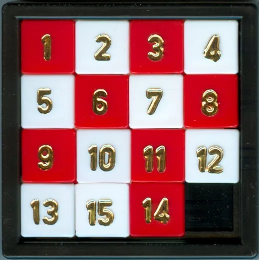

> ### 📄 예제 문제.

* 절단점 찾기
  * 역(정점)과 철도망(간선), 한 간선을 삭제하면 철도망 전체가 두개 이상으로 쪼개지는지 판정

* 무가중치 그래프 최단 거리
  * 소셜 네트워크 몇명을 건너가야 아는사이인가.

* 최소 스패닝 트리
  * 라우터(정점)들이 네트워크(간선)로 연결되어 있을때, 인터넷 전송 속도 계산.
  * 어느 간선들을 사용해야 두 컴퓨터간의 전송 용량을 최적화 할 수 있을까.

* 오일러 경로(한붓 그리기)
  * 연필을 떼지 않고 주어진 도형을 그리되, 모든 선을 한번씩만 지날 수 있는가

* 방향 그래프를 타고 타고 원점으로 돌아 왔을떄 이득이 되는 상황 존재 여부 (간선 가중치의 합이 음수인 사이클이 존재한다는것)
  * 아비트러지 환율 목록이 주어질 때, 아비트러지가 존재하는지 여부 확인.
  ```cpp
  struct Edge {
	int from, to;
	int w;
  }
  bool arbitrage = false;
  vector<Edge> cyclePath;
  int baseRes = 1;
  int res = 1;
  for(auto& e : cyclePath) {
	res *= e.w;
  }
  if(res > baseRes) {
	arbitrage = true;
  }
  ```

> ### 📄 암시적 그래프 (implicit graph) 문제 예제

#### 그래프와 같은 형태를 갖는 구조가 아니더라도, 그래프로 표현하면 쉽게 해결할 수 있는 문제를 말함

* 위상정렬 깊이 우선 탐색
  * 스타크래프트의 빌딩 순서

* 그래프 최단거리 (BFS, DFS, 다익스트라, A*)
  * 15 퍼즐 게임판의 현재 타일의 배치를 그래프를 응용해 풀 수 있음
    * 정점 : 4x4 형태를 캡쳐링 한 상태(정점), (4x4 아무 타일을 하나 음직여서 보드에 변형시킨 상태)도 정점임
    * 간선 : "캡쳐링 상태"와 "변형시킨 상태"를 연결하는것은 간선
    * 불가능한 상태도 존재함.
  * 

* 이분그래프 게임판 덮기
  * NxN 정사각형 게임판을 1x2 크기의 블록으로 덮는 문제 & 블록을 겹쳐서 놓을 수 없음

* 만족성 문제, 2-SAT, 강 결합성 문제
  * 회의실 배정 각 회의실을 사용하고 싶은 시간을 각각 두개씩 적어 낸다.
  * 회의실은 한번에 한팀만 사용할 수 있고, 중간에 회의를 끊을 수 없음
  * 각 팀마다 적어낸 두시간 중 하나씩을 배정해서 모든 팀이 회의하도록 한다.
