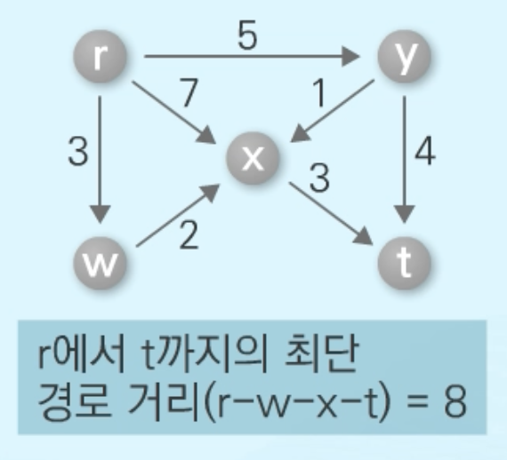

> ### 📄 다익스트라

#### 시작 정점에서 거리가 최소인 정점부터 선택해 나가며 최단 거리를 구한다.
* 최소 신장 트리를 구하기 위해 정점을하나씩 선택하는 프림 알고리즘과 유사한 방식이다.
* 시작점 -> 끝점 까지의 최단 경로에 중간 정점이 있다.
  ```
  DIST[E] VS DIST[M] + Weight[M][E];
  ```

<div align=center>
    
    <h5></h5>
</div>

#### 1). 다익스트라 알고리즘 (간단 순서)

<div align=center>
    
    
    <h5></h5>
</div>


##### 시작점에서의 최단 경로를 찾은 정점들의 집합(S)을 관리
* 최초 $S = \{r\}, d[r] = 0, d[v] = \infty ( v \in V - U )$ 
* 최단 경로를 찾은 정점을 하나씩 집합 S에 추가 집합 
* S에 포함되지 않은 정점들 중에 출발점에 가장 가까운 정점 선택

##### ① 초기화: 모든 정점의 거리 
`DIST[] = INF`
`DIST[start] = 0`

##### ② 우선순위 큐에 시작 정점 삽입

```cpp
priority_queue<pii> pq;
pq.push({curVtx, dist});
```

##### ③ 우선 순위 큐 빌때까지 루프


* while (pq not empty):
  * pq.top()로 현재 방문할 정점 `curVtx`와 그때의 거리 `dist` 를 꺼냄 (pop) `curVtx, dist`
  * 꺼낸 `dist`가 `DIST[curVtx]`보다 크면 (이미 더 좋은 경로가 있음) continue
  * curVtx의 모든 이웃 nxtVtx에 대해 새로운 거리 `newCost = dist + weight(curVtx,nxtVtx)`를 계산
  * 만약 `newCost < DIST[nxtVtx]`이면 `DIST[nxtVtx] = newCost`, `pq에 (nxtVtx, newCost)`를 push

##### ④ DIST[target] 등에서 최단거리 확인

---

#### 2). 현재 코드의 치명적 문제들 (우선순위/구조/인덱스 등)
* A. pq에 넣는 값의 필드 순서가 뒤바뀜 (가장 심각)
  * struct E { int vtx; int w; } 이고 G 에는 edge로 {to, adj}로 잘 넣음.
  * 하지만 DIJK에서 pq.push({0, start}); 처럼 넣어 `vtx=0, w=start`가 됨 — 완전 역전.
  * 결과: pq의 요소가 (vtx,w) 가 아닌 (w,vtx)로 해석되어 알고리즘이 망가짐.
* B. ResetState의 루프 범위 오프바이원
  * 현재: for(int i = 1; i <= MAX_V; i++) { ... }  → G[MAX_V] 또는 DIST[MAX_V] 접근(버퍼 오버)
  * 올바른 범위: 0..MAX_V-1 또는 1..(V_CNT) (프로그램 계약에 따라)
* C. priority_queue 타입 선언과 comparator 혼동(현재는 vector<E> G[], pq는 default)
  * struct E의 operator< 구현을 통해 min-heap 의도를 만들어도, pq에 넣는 값이 잘못되면 무의미.
* D. 초기 PQ push와 이후 push 모두 필드 순서 오류가 동일하게 있음 → 전체 알고리즘 무효
* E. DIST 초기화/ResetState: 글로벌 초기값 {0,} 대신 ResetState에서 확실히 INF로 세팅해야 함(이미 함수에서 처리하니 괜찮지만, 오프바이원 주의)

> ### 📄 벨만 포드

> ### 📄 플루이드 워셜