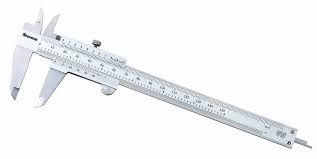

> ### 📄 벡터

---

> ### 📄 [CCW](https://stonejjun.tistory.com/37)

#### 1). 기본 기하
* 반시계 방향 : 벡터 외적의 절대값은 양수 CCW
* 두점 사이 거리
* 점과 직선 사이 거리
* 외적을 이용한 삼각형 넓이 구하기

#### 2). 다각형 넓이 구하기

##### ① 볼록 다각형 

##### ② 오목 다각형 

```cpp
//볼록이든 오목이든 둘다 동일함
for(int s = 0; s+1 < A.size(); s++)
    sum += CCW_({0, 0}, A[s], A[s+1]);
```

#### 3). 각도 정렬

#### 4). 선분 교차 판별

* 알고리즘이 없다.템플릿 복붙 하는게 좋다.

* $\vec{a}, \vec{-a}, \vec{b}, \vec{-b}$ 얘네 싸그리 다 한번확인 해야 한다.

```cpp
// 직접 구현하지 말고 템플릿 써라
// 이거 빡구현은 효용성이 없다.
bool isCrossing(P a, P b, P c) {
    return ab <= 0 && cd == 0;
}
```

---

> ### 📄 [내부 판별](https://stonejjun.tistory.com/39)

#### 다각형 내부 점 판별
##### ① 볼록 다각형 $O(logN)$
* 로그 방식의 점 판별 ㅈㄴ 중요함
* 원리는 이분탐색이다.

##### ② 오목 다각형 $O(N)$

가로로 선 쭉 긋고
직접 만들지 마라 = 템플릿 사용 추천한다

---

> ### 📄 [컨벡스 헐](https://stonejjun.tistory.com/40)

* 점 리스트 주어졌을떄.
* 개념상 ,올가미를 던지고 쭉 줄였을때의 둘레가 컨벡스헐의 둘레임.

##### ① 볼록 다각형
##### ② 오목 다각형

---

> ### 📄 [로테이팅 캘리퍼스](https://stonejjun.tistory.com/42)

* 이 알고리즘의 목적은..
* 점이 ㅈㄴ 분산되어 있는 상태임 가장 먼 두점 찾기.
* BF쓰면? : $O(N^2)$
* 정렬을 넣으면 $O(logN) * N$
* 정렬 필요 없으면 $O(N)$

#### 정답은 컨벡스 헐을 이루는 점중에서 가장 먼거 찾으면 됨.
* 여기서도 BF를 사용하면 $O(N^{ \frac{2}{3} })$
  이것도 느리다..
* 이걸 $O(N)$으로 구하려면.. 로케이팅 캘리퍼스를 써야 한다.
  *  이게 캘리퍼스고
  * 캘리퍼스를 360도 돌렸을떄, 가장 큰 값이 바로 가장 먼 점사이 거리지 않겠느냐? 네.
  * 투포인터를 사용해야함 중심을 지나는 선이 이루는 두 점
  * 두 점이 서로 반대편이려면 CCW가 갑자기 음수가 되는 지점이 바로 두 점이 바로 반대라는거다.
  * $S$ = 스타트 인덱스 $T$ = 끝 인덱스


```
#include <iostream>
#include <fstream>
#include <deque>
#include <iomanip>
#include <cmath>
using namespace std;
#define FASTIO ios::sync_with_stdio(false); cin.tie(nullptr);
#define X first
#define Y second
typedef long long ll;
typedef pair<ll, ll> pll;

ostream& operator<<(ostream& os, const pll& p) {
	os << p.X << ' ' << p.Y;
	return os;
}

ll CCW_(const pll &a, const pll &b, const pll &c)
{
	return (a.X * b.Y + b.X * c.Y + c.X * a.Y) - (a.Y * b.X + b.Y * c.X + c.Y * a.X);
}

int CCW(const pll &a, const pll &b, const pll &c) {
	ll ret = CCW_(a, b, c);
	return (ret > 0) - (ret < 0);
}


ll PPDistSq(const pll &a, const pll &b) {
	ll dx = a.X - b.X;
	ll dy = a.Y - b.Y;
	return dx*dx + dy*dy;
}

ll Area(const pll &a, const pll &b, const pll &c) {
	pll vab = pll(b.X - a.X, b.Y - a.Y);
	pll vbc = pll(c.X - b.X, c.Y - b.Y);
	return CCW_({0, 0}, vab, vbc);
}

ll PLDistSq(const pll &p, const pll &a, const pll &b) {
	return (Area({0, 0}, a, b) * Area({0, 0}, a, b)) / PPDistSq(a, b);
}

int main()
{
	int N; 
	deque<pll> POINTS;
	cin >> N;
	for(int i = 0; i < N; i++) {
		ll x, y; cin >> x >> y;
		POINTS.push_back({x, y});
	}
	POINTS.push_back(POINTS.front());
	ll sum = 0;
	while(POINTS.size() > 1) {
		pll pt1 = POINTS.front(); POINTS.pop_front();
		pll pt2 = POINTS.front();
		ll area = Area({0, 0}, pt1, pt2);
		CCW({0, 0}, pt1, pt2) < 0?
			sum -= area :
			sum += area;
	}
	cout << fixed << setprecision(1) << (sum*100) / 200.0 << '\n';
}
```